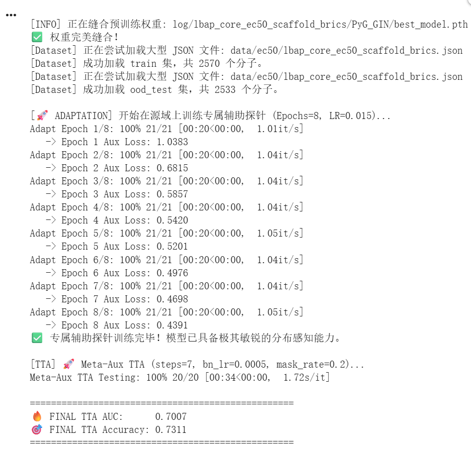

# TTA 调参记录总结


```
!python evaluate_drugtta.py \
  --model_path log/lbap_core_ec50_scaffold_brics/PyG_GIN/best_model.pth \
  --train_path data/ec50/lbap_core_ec50_scaffold_brics.json \
  --test_path data/ec50/lbap_core_ec50_scaffold_brics.json \
  --batch_size 128 \
  --adapt_epochs 8 \
  --adapt_lr 0.015 \
  --inner_steps 7 \
  --aux_lr 0.005 \
  --bn_lr 5e-4 \
  --mask_rate 0.2 \
  --aux_weight 1 \
  --seed 2022 \
  --device 0
```
## 一、当前最优参数

| 参数 | 最优值 | 说明 |
|------|--------|------|
| `adapt_lr` | **0.015** | 阶段一 aux 头学习率 |
| `adapt_epochs` | **8** | 阶段一训练轮数 |
| `inner_steps` | **7** | 每 batch adaptation 步数 |
| `bn_lr` | **5e-4** | 阶段二 BN 层学习率 |
| `aux_lr` | 0.005 | 阶段二 aux 学习率 |
| `mask_rate` | 0.2 | 节点掩码比例 |
| `batch_size` | 128 | — |
| `seed` | 2022 | — |

**最优 AUC: 0.7007**（MoleOOD 基线 0.6691，+3.16 个点 | 原始 TTA 0.6795，+2.12 个点）

---

## 二、各参数调优曲线

### 2.1 bn_lr 扫描

```
AUC
0.6800 ┤           ●(0.6797)
0.6795 ┤ ●(0.6795)
0.6790 ┤                       ●(0.6790)
0.6785 ┤
       ├─────┼─────┼─────┼─────┼─────┼─────
      1e-4  2e-4   4e-4  6e-4  8e-4  1e-3
                        bn_lr
```

| bn_lr | AUC | Δ |
|-------|-----|---|
| 1e-4 | 0.6795 | baseline |
| **5e-4** | **0.6797** | +0.0002 |
| 1e-3 | 0.6790 | -0.0007 |

→ 提升有限，BN adaptation 略保守时需要微增

---

### 2.2 adapt_lr 扫描 (bn_lr=5e-4)

```
AUC
0.695 ┤
      ┤
0.690 ┤                       ●(0.6916)
      ┤                      ╱
0.685 ┤          ●(0.6797)  ╱
      ┤         ╱          ╱             ●(0.6866)
0.680 ┤        ╱          ╱             ╱
      ┤       ╱          ╱             ╱
0.675 ┤      ╱          ╱             ╱
      ┤     ╱          ╱             ╱
0.670 ┤    ╱          ╱             ╱
      ┤   ╱          ╱             ╱
0.665 ┤  ╱          ╱             ╱
      ┤ ╱          ╱             ╱
0.660 ┤╱          ╱             ╱
0.655 ┤          ╱             ╱
0.650 ┼●(0.6500)╱             ╱
      ├────┼────┼────┼────┼────┼────┼────
    0.005 0.007 0.010 0.012 0.015 0.017 0.020
                        adapt_lr
```

| adapt_lr | AUC | Δ |
|----------|-----|---|
| 5e-3 | 0.6500 | -0.0295 |
| 0.01 | 0.6797 | baseline |
| **0.015** | **0.6916** | **+0.0119** |
| 0.02 | 0.6866 | -0.0050 |

→ **影响最大的参数**，最优点 0.015，过低欠拟合，过高过拟合

---

### 2.3 adapt_epochs 扫描 (adapt_lr=0.015, bn_lr=5e-4)

```
AUC
0.700 ┤               ●(0.6994)
      ┤              ╱ ╲
0.697 ┤         ●(0.6955) ╲
      ┤        ╱            ╲
0.694 ┤   ●(0.6916)          ╲
      ┤  ╱                     ●(0.6952)
0.691 ┤ ╱                        ╲
      ┤╱                           ╲
0.688 ┤                              ●(0.6928)
      ┤
0.685 ┤
      ├────┼────┼────┼────┼────┼────
      5    6    7    8    9   10
                 adapt_epochs
```

| adapt_epochs | AUC | aux_loss (末轮) |
|--------------|-----|-----------------|
| 5 | 0.6916 | 0.5191 |
| 7 | 0.6955 | — |
| **8** | **0.6994** | **0.4377** |
| 9 | 0.6952 | 0.4146 |
| 10 | 0.6928 | 0.4122 |

→ 尖峰在 8，之后 aux loss 进入平台期（0.4146→0.4122），梯度太弱导致 TTA 退化

---

### 2.4 inner_steps 扫描 (adapt_lr=0.015, bn_lr=5e-4, adapt_epochs=8)

```
AUC
0.701 ┤                    ●(0.7007)
      ┤                   ╱
0.700 ┤              ●(0.6994)
      ┤             ╱
0.699 ┤            ╱
      ┤           ╱
0.698 ┤          ╱
      ┤         ╱
0.697 ┤        ╱
      ┤       ╱
0.696 ┤      ╱
      ├─────┼─────┼─────┼─────
      3     4     5     6     7
                 inner_steps
```

| inner_steps | AUC | Δ |
|-------------|-----|---|
| 3* | 0.6791 | — |
| 5 | 0.6994 | baseline |
| **7** | **0.7007** | **+0.0013** |

*注：inner_steps=3 时的 aux_lr=0.01，非严格对比

→ 更多 adaptation 步数持续带来收益，但边际递减明显（+0.0013 vs +0.0078 vs +0.0119）

---

## 三、累计提升曲线

```
AUC
0.705 ┤
      ┤                                    ●0.7007 (+inner_steps=7)
0.700 ┤                              ●0.6994 (+adapt_epochs=8)
      ┤                         ╱
0.695 ┤                    ●0.6916 (+adapt_lr=0.015)
      ┤                   ╱
0.690 ┤                  ╱
      ┤                 ╱
0.685 ┤                ╱
      ┤               ╱
0.680 ┤    ●0.6795 baseline TTA
      ┤   ╱
0.675 ┤  ╱
      ┤ ╱
0.670 ┤╱
      ┤
0.665 ┤ ●0.6691 MoleOOD (no TTA)
      ├────┬────┬────┬────┬────┬────┬────
    起点  参数1 参数2 参数3 参数4 参数5 参数6
         (原TTA)(bn_lr)(adapt_lr)(epochs)(inner)
         0.6795 0.6797  0.6916   0.6994 0.7007
```

| 阶段 | 改动 | AUC | 该步提升 | 累计提升 |
|------|------|-----|----------|----------|
| MoleOOD 基线 | 无 TTA | 0.6691 | — | — |
| 原始 TTA | — | 0.6795 | +1.04 | +1.04 |
| +bn_lr 优化 | 1e-4 → 5e-4 | 0.6797 | +0.02 | +1.06 |
| +adapt_lr 优化 | 0.01 → 0.015 | 0.6916 | +1.19 | +2.25 |
| +adapt_epochs 优化 | 5 → 8 | 0.6994 | +0.78 | +3.03 |
| +inner_steps 优化 | 5 → 7 | **0.7007** | +0.13 | **+3.16** |

---

## 四、各参数敏感性排名

| 排名 | 参数 | 最优值 | 调优收益 | 曲线形状 |
|------|------|--------|----------|----------|
| 1 | `adapt_lr` | 0.015 | **+1.19** | 尖峰 |
| 2 | `adapt_epochs` | 8 | **+0.78** | 尖峰 |
| 3 | `inner_steps` | 7 | +0.13 | 缓慢上升 |
| 4 | `bn_lr` | 5e-4 | +0.02 | 平坦 |

---

## 五、待探索维度

### 5.1 超参数（低风险、低收益）

| 参数 | 当前值 | 优先级 | 建议范围 |
|------|--------|--------|----------|
| `aux_lr` | 0.005 | ⭐⭐ | 0.003, 0.008 |
| `mask_rate` | 0.2 | ⭐⭐ | 0.15, 0.25 |
| `inner_steps` | 7 | ⭐ | 9, 10（边际递减） |

### 5.2 算法改进（中等风险、潜在高收益）

代码已支持以下新参数，详见 evaluate_drugtta.py：

| 参数 | 默认值 | 建议首试 | 原理 |
|------|--------|----------|------|
| `--temperature` | 1.0 | 2.0, 3.0 | 让 KL teacher 分布更平滑 |
| `--conf_threshold` | 0.0 | 0.6, 0.8 | 只对低置信度样本算 main_loss |
| `--num_mask_aug` | 1 | 3, 5 | 多次 mask 增强平均 |
| `--consistency_type` | kl | mse, cos | 换一致性损失函数 |
| `--grad_clip` | 0.0 | 0.5, 1.0 | 防止梯度尖峰 |

**推荐顺序**：
1. 快速扫 `aux_lr` → 如果无收益，直接切算法改进
2. `temperature=2.0` 和 `conf_threshold=0.6` 最值得试
3. 如果 temperature 有效，联合 `num_mask_aug` 一起用

